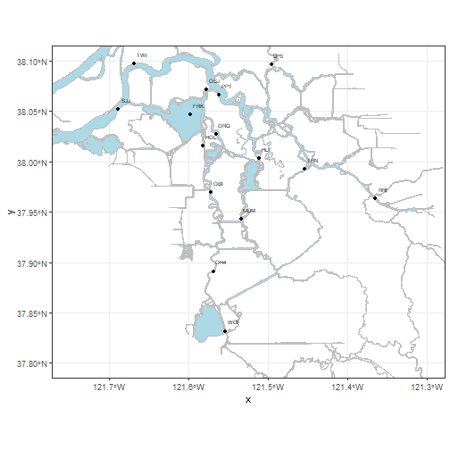
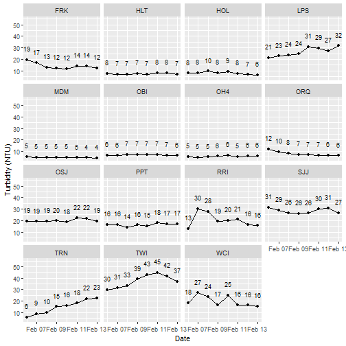
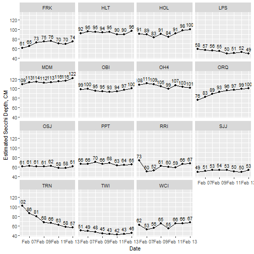
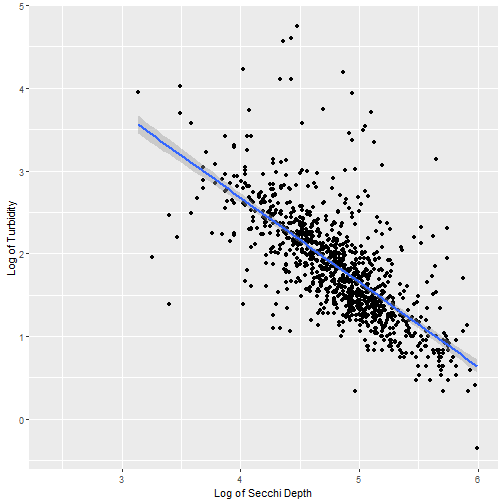

## Daily average turbidities

This is a summary of daily average turbidity for several stations in the Delta.

test again2



## Here is the average turbidity for the past 7 days

(all stations combined, first turbidity, then secchi)


Here are the daily averages from the individual stations. 



Here it is converted to secchi depth



### A note on secchi conversions

Turbidity and secchi depth have a pretty good correlation when both are log-transformed. However, secchi depth is subject to some degree of variability with observer, weather, time of day, waves, and whether the observer has had their coffee. Turbidity, as measured by a sonde, is also subject to some variability depending on when the sonde was last calibrated.

To convert between turbidity and secchi depth for the purpose of this document, we used secchi depth data from an integrated dataset of discrete water quality (Bashevkin et al, 2013), collected by IEP surveys from 2010-2022 for the South Delta (area shown in map above). The secchi depths were matched to the nearest continuous station's daily average turbidity. Data is available on GitHub here: [discretewq](https://github.com/InteragencyEcologicalProgram/discretewq)

We then log-transformed secchi depth and turbidity and conducted a linear regression.


```
## `geom_smooth()` using formula = 'y ~ x'
```

```
## Warning: Removed 2248 rows containing non-finite values (`stat_smooth()`).
```

```
## Warning: Removed 2248 rows containing missing values (`geom_point()`).
```



We used this regression to estimate the secchi depth given the turbidity from the continuous sondes.

Here's the formula:

Secchi = exp(-0.44*log(Turbidity) +5.4)


Here is the model output:

```r
summary(convert3)
```

```
## 
## Call:
## lm(formula = log(Secchi) ~ log(Turbidity), data = WQx2a)
## 
## Residuals:
##      Min       1Q   Median       3Q      Max 
## -2.39189 -0.17723  0.03534  0.21727  2.33580 
## 
## Coefficients:
##                 Estimate Std. Error t value Pr(>|t|)    
## (Intercept)     5.409359   0.016959   319.0   <2e-16 ***
## log(Turbidity) -0.438516   0.008968   -48.9   <2e-16 ***
## ---
## Signif. codes:  0 '***' 0.001 '**' 0.01 '*' 0.05 '.' 0.1 ' ' 1
## 
## Residual standard error: 0.3796 on 3290 degrees of freedom
##   (5 observations deleted due to missingness)
## Multiple R-squared:  0.4209,	Adjusted R-squared:  0.4207 
## F-statistic:  2391 on 1 and 3290 DF,  p-value: < 2.2e-16
```

For all the code behind this analysis, please see: 

https://github.com/EMRR-DISE/SMTWaterQuality 
